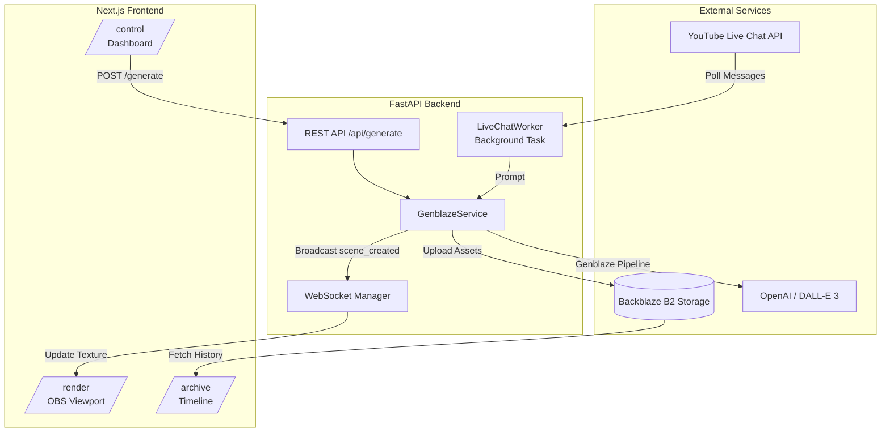

# CrowdVJ

CrowdVJ is an AI-powered interactive livestream visualizer built for hackathons. It autonomously generates high-quality visual scenes in real-time by analyzing YouTube live chat messages (or running in simulation mode), synthesizing a cohesive prompt, and rendering the result in a rich 3D environment using React Three Fiber.

## 🚀 Project Overview

The system consists of three main components:
1. **FastAPI Backend**: Orchestrates the AI image generation using the `genblaze-core` pipeline SDK, stores assets redundantly into Backblaze B2, and handles WebSocket broadcasts to connected clients.
2. **Background Worker**: Continuously polls YouTube Live Chat (or uses a simulated chat stream), extracts dominant themes every 20 seconds, and submits automated generation requests.
3. **Next.js Frontend**:
   - `/render`: A fullscreen WebGL scene built with React Three Fiber, featuring dynamic particles, audio-reactivity, and smooth texture crossfading of generated AI images. Optimized for OBS capture (60 FPS, no memory leaks).
   - `/control`: A dashboard for manual generation overrides, quick simulation buttons, and WebSocket debug logs.
   - `/archive`: A timeline and scene viewer fetching directly from Backblaze B2, complete with canonical provenance metadata and SHA-256 hashes.

## 🏗 Architecture & Data Flow



## 📁 Folder Structure

```text
crowdvj/
├── backend/
│   ├── main.py                 # FastAPI app & WebSocket manager
│   ├── routers/
│   │   └── api.py              # REST API routes
│   └── services/
│       ├── chat_worker.py      # Background task polling chat
│       └── genblaze_service.py # genblaze-core Pipeline & B2 uploads
├── frontend/
│   └── src/app/
│       ├── render/             # Fullscreen R3F visualizer
│       ├── control/            # Operator dashboard
│       └── archive/            # B2 Scene Viewer
└── README.md
```

## ☁️ Hướng dẫn Deploy (Triển khai Hackathon)

Để tối ưu chi phí (hoàn toàn miễn phí) và thời gian cho Solo Developer, dự án được thiết kế để triển khai theo mô hình Cloud-Native phân tách:
- **Frontend (Next.js)**: Deploy lên Vercel.
- **Backend (FastAPI)**: Deploy lên Render (hoặc Railway/Fly.io).
- **Storage**: Backblaze B2.
- **AI Compute**: GMI Cloud (Thông qua Genblaze SDK tích hợp sẵn trong Backend).

### Bước 1: Triển khai Backend (FastAPI) lên Render.com
1. Đưa toàn bộ mã nguồn lên một GitHub Repository.
2. Đăng nhập Render.com, chọn **New** -> **Web Service**.
3. Kết nối với repo GitHub của dự án CrowdVJ.
4. Cấu hình Render:
   - **Root Directory**: `backend`
   - **Build Command**: `pip install -r requirements.txt`
   - **Start Command**: `uvicorn main:app --host 0.0.0.0 --port $PORT`
5. Trong mục Environment, nhập các biến môi trường:
   - `B2_ENDPOINT`, `B2_BUCKET`, `B2_KEY_ID`, `B2_APPLICATION_KEY`
   - Khóa API của GMI Cloud / OpenAI (nếu dùng thực tế) hoặc đặt `USE_MOCK_GENBLAZE=true` để test giao diện.
6. Bấm Deploy. Bạn sẽ nhận được một URL HTTPS (ví dụ: `https://crowdvj-backend.onrender.com`).

### Bước 2: Triển khai Frontend (Next.js) lên Vercel
1. Đăng nhập Vercel.com, bấm **Add New...** -> **Project**.
2. Import repo GitHub CrowdVJ.
3. Cấu hình Vercel:
   - **Root Directory**: Chọn thư mục `frontend`.
   - Khung làm việc sẽ tự động nhận diện là Next.js.
4. Trong mục Environment Variables, thêm:
   - `NEXT_PUBLIC_BACKEND_URL`: URL của backend Render ở Bước 1.
   - `NEXT_PUBLIC_WS_URL`: Đổi `https://` thành `wss://` (ví dụ: `wss://crowdvj-backend.onrender.com/ws`).
5. Bấm Deploy. Vercel sẽ tự động build và cấp cho bạn một tên miền miễn phí (ví dụ: `https://crowdvj.vercel.app`).

### Bước 3: Đưa vào sử dụng trên OBS
Hệ thống lúc này đã chạy 100% trên Cloud với chứng chỉ SSL/HTTPS tự động được cấp.
1. Mở OBS Studio, tạo một **Browser Source** mới.
2. Nhập URL: `https://crowdvj.vercel.app/render`.
3. Chỉnh kích thước khung hình (1920x1080) và tích chọn "Control audio via OBS".
4. Ban giám khảo có thể trực tiếp vào `https://crowdvj.vercel.app/archive` để chấm điểm dữ liệu đọc thẳng từ Backblaze B2, trong khi bạn rảnh tay quay video demo mà không cần đụng tới dòng lệnh Linux nào!

## 📦 Genblaze Integration Details

We utilize the official `genblaze-core` and `genblaze-openai` SDKs. 
The integration is encapsulated in `backend/services/genblaze_service.py`. It uses the `Pipeline` abstraction to enforce standard generative workflows. 

## 🗄 Backblaze B2 Storage Layout

Every generated scene is reliably persisted to B2 using the standard S3 (`boto3`) interface to ensure a strict directory structure:

```text
sessions/
    {session_id}/
        scene-{scene_id}/
            winner.webp                  # The final generated image
            candidates/cand_0.webp       # Alternate images (if any)
            metadata.json                # Genblaze Run/Manifest IDs
            provenance.json              # Canonical hash data, latency, and prompt
```
This data drives the `/archive` timeline directly.

## 🎥 Demo Walkthrough

1. **Boot**: Start both frontend and backend.
2. **Render Page**: Open `http://localhost:3000/render` in OBS Studio. It will prompt for audio (to drive the particle reactivity) and wait for the first image.
3. **Control Page**: Open `http://localhost:3000/control`. You can watch the `LiveChatWorker` simulate chat generations every 20 seconds, or you can force a generation using the "Simulate Live Chat" quick buttons.
4. **Transition**: Watch the OBS `/render` page smoothly crossfade into the new image.
5. **Review**: Open `http://localhost:3000/archive` to browse the generated sessions and download the high-res artifacts directly from Backblaze B2.
